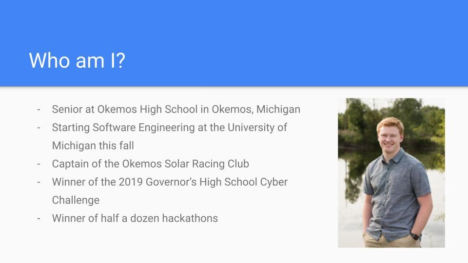
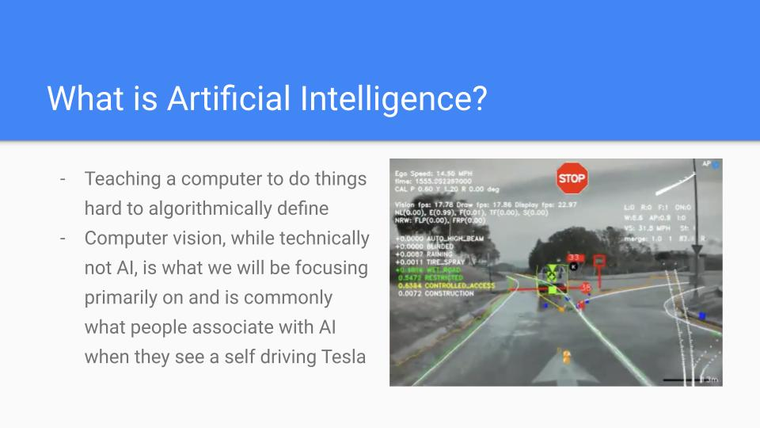
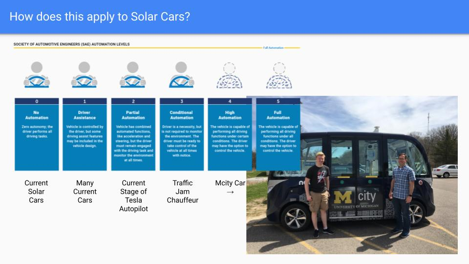
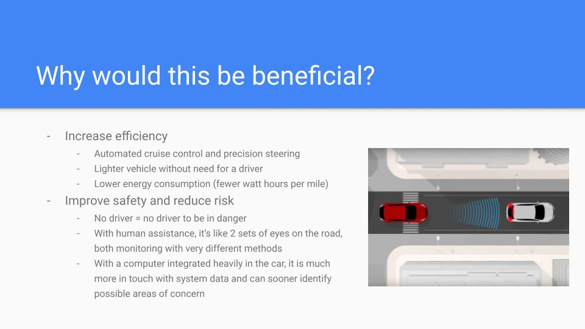
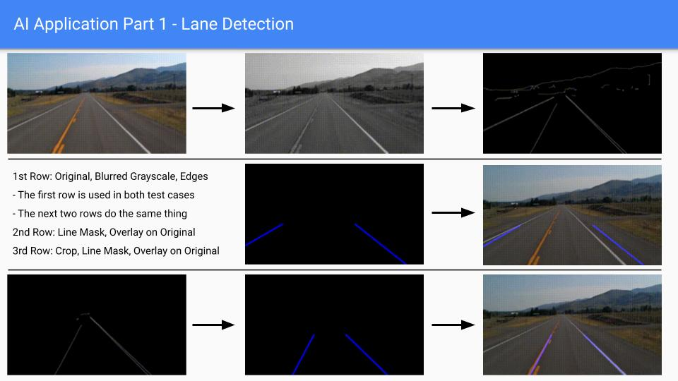
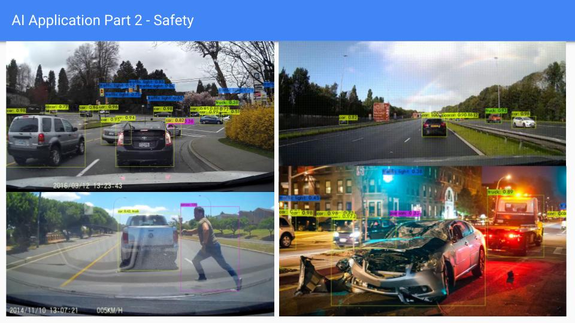
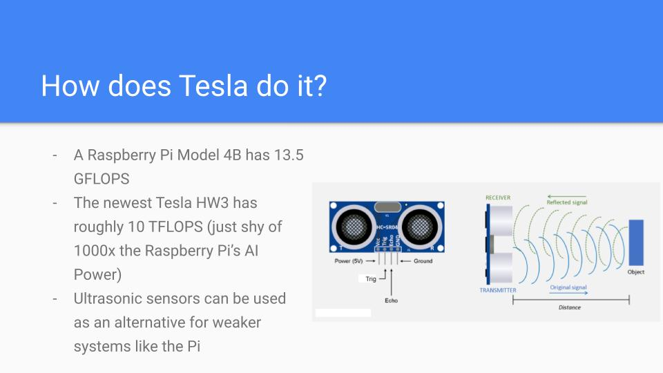

# Artificial Intelligence in the Solar Car Challenge

How to use Computer Vision and Artificial Intelligence to turn this:

Into this:

### Setup

To run this code, you will need to initialize a virtual environment in python and then install the required libraries by running: `pip install -r requirements.txt`

Run computer-vision.py and computer-vision-no-crop.py by running `python computer-vision.py filename.mp4`.

To use the AI video analyzer, see [darknet](https://github.com/AlexeyAB/darknet) and then run do-video.py to take an video and rebuild it with individually written analyzed frames.

### Watch the Webinar [here.](https://www.youtube.com/watch?v=IwrX5crwRrk&t=2362s)

### View the PowerPoint [here.](https://github.com/EricAndrechek/Solar-Car-Challenge-AI-Demo/raw/main/presentation/AI%20in%20the%20Solar%20Car%20Challenge.pdf)

